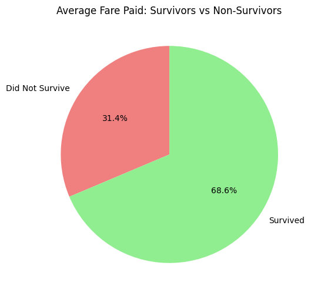

# 🧪 2nd Exercise Notebook
### Hands-On with Pandas: A Beginner’s Exercise Notebook for Data Analysis

Welcome to your Pandas practice notebook! Pandas is one of the most powerful Python libraries for data analysis and is a cornerstone of python-based data analysis. 
In this notebook, you'll work through a series of exercises that will help you understand the structure and capabilities of Pandas, and apply them to real datasets.


## 1. Getting Started with Pandas

Pandas provides high-performance, easy-to-use data structures: `Series` (1D) and `DataFrame` (2D). It is particularly useful for cleaning, transforming, and analyzing structured data.

We'll begin by loading a dataset and doing some initial exploration.


```python
import pandas as pd
import matplotlib.pyplot as plt
```


```python
# ✅ Task for students: Load the Titanic dataset from seaborn into a pandas dataframe named df and display the first few rows

# Step 1: Import necessary libraries
import seaborn as sns

# Step 2: Load the Titanic dataset into a DataFrame named df
df = sns.load_dataset('titanic')

# Step 3: Display the first few rows
# print(df.head())

df.head()

```


<div>
<style scoped>
    .dataframe tbody tr th:only-of-type {
        vertical-align: middle;
    }

    .dataframe tbody tr th {
        vertical-align: top;
    }

    .dataframe thead th {
        text-align: right;
    }
</style>
<table border="1" class="dataframe">
  <thead>
    <tr style="text-align: right;">
      <th></th>
      <th>survived</th>
      <th>pclass</th>
      <th>sex</th>
      <th>age</th>
      <th>sibsp</th>
      <th>...</th>
      <th>adult_male</th>
      <th>deck</th>
      <th>embark_town</th>
      <th>alive</th>
      <th>alone</th>
    </tr>
  </thead>
  <tbody>
    <tr>
      <th>0</th>
      <td>0</td>
      <td>3</td>
      <td>male</td>
      <td>22.00</td>
      <td>1</td>
      <td>...</td>
      <td>True</td>
      <td>NaN</td>
      <td>Southampton</td>
      <td>no</td>
      <td>False</td>
    </tr>
    <tr>
      <th>1</th>
      <td>1</td>
      <td>1</td>
      <td>female</td>
      <td>38.00</td>
      <td>1</td>
      <td>...</td>
      <td>False</td>
      <td>C</td>
      <td>Cherbourg</td>
      <td>yes</td>
      <td>False</td>
    </tr>
    <tr>
      <th>2</th>
      <td>1</td>
      <td>3</td>
      <td>female</td>
      <td>26.00</td>
      <td>0</td>
      <td>...</td>
      <td>False</td>
      <td>NaN</td>
      <td>Southampton</td>
      <td>yes</td>
      <td>True</td>
    </tr>
    <tr>
      <th>3</th>
      <td>1</td>
      <td>1</td>
      <td>female</td>
      <td>35.00</td>
      <td>1</td>
      <td>...</td>
      <td>False</td>
      <td>C</td>
      <td>Southampton</td>
      <td>yes</td>
      <td>False</td>
    </tr>
    <tr>
      <th>4</th>
      <td>0</td>
      <td>3</td>
      <td>male</td>
      <td>35.00</td>
      <td>0</td>
      <td>...</td>
      <td>True</td>
      <td>NaN</td>
      <td>Southampton</td>
      <td>no</td>
      <td>True</td>
    </tr>
  </tbody>
</table>
<p>5 rows × 15 columns</p>
</div>


### Exercise 1.1 
✅ Tasks for students:
google how to do the following.
configure pandas visualization: You can configure display settings, so your DataFrames look cleaner and are easier to interpret.


```python
#  Display less columns and rows (10, 10)

pd.set_option('display.max_rows', 10)
pd.set_option('display.max_columns', 10)


# Align column headers nicely

# Center-align column headers
df.style.set_table_styles(
    [{'selector': 'th', 'props': [('text-align', 'center')]}]
)


# Set column width to 100 and precision to 2

# Set column width to 100
pd.set_option('display.max_colwidth', 100)

# Set precision to 2 for floating-point numbers
pd.set_option('display.precision', 2)


# Set float display precision to 2

pd.options.display.float_format = '{:.2f}'.format

# Example
df2 = pd.DataFrame({'A': [1.12345, 2.6789], 'B': [3.98765, 4.54321]})
# print(df)

 
# df2.head()

df.head()

```


<div>
<style scoped>
    .dataframe tbody tr th:only-of-type {
        vertical-align: middle;
    }

    .dataframe tbody tr th {
        vertical-align: top;
    }

    .dataframe thead th {
        text-align: right;
    }
</style>
<table border="1" class="dataframe">
  <thead>
    <tr style="text-align: right;">
      <th></th>
      <th>survived</th>
      <th>pclass</th>
      <th>sex</th>
      <th>age</th>
      <th>sibsp</th>
      <th>...</th>
      <th>adult_male</th>
      <th>deck</th>
      <th>embark_town</th>
      <th>alive</th>
      <th>alone</th>
    </tr>
  </thead>
  <tbody>
    <tr>
      <th>row_1</th>
      <td>0</td>
      <td>3</td>
      <td>male</td>
      <td>22.00</td>
      <td>1</td>
      <td>...</td>
      <td>True</td>
      <td>NaN</td>
      <td>Southampton</td>
      <td>no</td>
      <td>False</td>
    </tr>
    <tr>
      <th>row_2</th>
      <td>1</td>
      <td>1</td>
      <td>female</td>
      <td>38.00</td>
      <td>1</td>
      <td>...</td>
      <td>False</td>
      <td>C</td>
      <td>Cherbourg</td>
      <td>yes</td>
      <td>False</td>
    </tr>
    <tr>
      <th>row_3</th>
      <td>1</td>
      <td>3</td>
      <td>female</td>
      <td>26.00</td>
      <td>0</td>
      <td>...</td>
      <td>False</td>
      <td>NaN</td>
      <td>Southampton</td>
      <td>yes</td>
      <td>True</td>
    </tr>
    <tr>
      <th>row_4</th>
      <td>1</td>
      <td>1</td>
      <td>female</td>
      <td>35.00</td>
      <td>1</td>
      <td>...</td>
      <td>False</td>
      <td>C</td>
      <td>Southampton</td>
      <td>yes</td>
      <td>False</td>
    </tr>
    <tr>
      <th>row_5</th>
      <td>0</td>
      <td>3</td>
      <td>male</td>
      <td>35.00</td>
      <td>0</td>
      <td>...</td>
      <td>True</td>
      <td>NaN</td>
      <td>Southampton</td>
      <td>no</td>
      <td>True</td>
    </tr>
  </tbody>
</table>
<p>5 rows × 15 columns</p>
</div>


### Exercise 1.2
✅ Task for students: Inspect the dataset:
- Use `.info()` to understand the structure
- Use `.describe()` to get summary statistics
- Count the number of missing values per column


```python
# df.info()

#df.describe()


#df.isnull().sum()
```

## 2. Pandas Objects: Series and DataFrames

Everything in Pandas is built around `Series` and `DataFrame` objects. A `Series` is like a column in a spreadsheet, and a `DataFrame` is like the full table.

### Exercise 2.1
Create a `Series` and a `DataFrame` manually.


```python
# ✅ Task for students: Create a Series containing [10, 20, 30] as values and ['a', 'b', 'c'] as indices and print it

import pandas as pd

# Create a Series
s = pd.Series([10, 20, 30], index=['a', 'b', 'c'])

# Print the Series
print(s)


```

    a    10
    b    20
    c    30
    dtype: int64
    


```python
# ✅ Task for students: Create a DataFrame containing a dictionary with  names, ages, and cities of three imaginary people and print it


# Create a dictionary of data
data = {
    'Name': ['Alice', 'Bob', 'Charlie'],
    'Age': [25, 30, 22],
    'City': ['New York', 'Berlin', 'Tokyo']
}

# Convert dictionary to DataFrame
df2 = pd.DataFrame(data)

# Print the DataFrame
print(df2)

```

          Name  Age      City
    0    Alice   25  New York
    1      Bob   30    Berlin
    2  Charlie   22     Tokyo
    

### Exercise 2.2
✅ Task for students: Explore the components:
- `values`
- `index`
- `columns`


```python
print("DataFrame Values:\n", df.values)
print("\nDataFrame Index:\n", df.index)
print("\nDataFrame Columns:\n", df.columns)

```

    DataFrame Values:
     [[0 3 'male' ... 'Southampton' 'no' False]
     [1 1 'female' ... 'Cherbourg' 'yes' False]
     [1 3 'female' ... 'Southampton' 'yes' True]
     ...
     [0 3 'female' ... 'Southampton' 'no' False]
     [1 1 'male' ... 'Cherbourg' 'yes' True]
     [0 3 'male' ... 'Queenstown' 'no' True]]
    
    DataFrame Index:
     RangeIndex(start=0, stop=891, step=1)
    
    DataFrame Columns:
     Index(['survived', 'pclass', 'sex', 'age', 'sibsp', 'parch', 'fare',
           'embarked', 'class', 'who', 'adult_male', 'deck', 'embark_town',
           'alive', 'alone'],
          dtype='object')
    

## 3. Indexing and Selection

Selecting and filtering data is one of the most common tasks in data mining. Pandas provides powerful indexing options using `.loc`, `.iloc`, slicing, and Boolean masks.


```python
# ✅ Task for students: Use .loc (label-based) to print first or second row

df2.loc[1]

# Print the first row (label = 0)
#print("First Row:\n", df2.iloc[0])

# Print the second row (label = 1)
#print("\nSecond Row:\n", df2.loc[1])
```


    Name       Bob
    Age         30
    City    Berlin
    Name: 1, dtype: object


```python
# the loc works with any values used in the index regardless of the type
df.index = [f"row_{i+1}" for i in range(len(df))]

df.loc["row_4"]
```


    survived                 1
    pclass                   1
    sex                 female
    age                  35.00
    sibsp                    1
                      ...     
    adult_male           False
    deck                     C
    embark_town    Southampton
    alive                  yes
    alone                False
    Name: row_4, Length: 15, dtype: object


```python
# ✅ Task for students: Use .iloc (integer position-based) to print the first of the fifth row


print(df.iloc[4, 0])

print(df.iloc[4])


```

    0
    survived                 0
    pclass                   3
    sex                   male
    age                  35.00
    sibsp                    0
                      ...     
    adult_male            True
    deck                   NaN
    embark_town    Southampton
    alive                   no
    alone                 True
    Name: row_5, Length: 15, dtype: object
    

### Exercise 3.1

selection and selective printing


```python
# ✅ Task for students: Select the first 5 rows where passengers are female

print(df[df['sex'] == 'female'].head(5))


```

            survived  pclass     sex   age  sibsp  ...  adult_male  deck  \
    row_2          1       1  female 38.00      1  ...       False     C   
    row_3          1       3  female 26.00      0  ...       False   NaN   
    row_4          1       1  female 35.00      1  ...       False     C   
    row_9          1       3  female 27.00      0  ...       False   NaN   
    row_10         1       2  female 14.00      1  ...       False   NaN   
    
            embark_town alive  alone  
    row_2     Cherbourg   yes  False  
    row_3   Southampton   yes   True  
    row_4   Southampton   yes  False  
    row_9   Southampton   yes  False  
    row_10    Cherbourg   yes  False  
    
    [5 rows x 15 columns]
    


```python
# ✅ Task for students: Select all passengers under the age of 18

# Select passengers under 18
under_18 = df[df['age'] < 18]

# Display the result
print(under_18)

```

             survived  pclass     sex   age  sibsp  ...  adult_male  deck  \
    row_8           0       3    male  2.00      3  ...       False   NaN   
    row_10          1       2  female 14.00      1  ...       False   NaN   
    row_11          1       3  female  4.00      1  ...       False     G   
    row_15          0       3  female 14.00      0  ...       False   NaN   
    row_17          0       3    male  2.00      4  ...       False   NaN   
    ...           ...     ...     ...   ...    ...  ...         ...   ...   
    row_851         0       3    male  4.00      4  ...       False   NaN   
    row_853         0       3  female  9.00      1  ...       False   NaN   
    row_854         1       1  female 16.00      0  ...       False     D   
    row_870         1       3    male  4.00      1  ...       False   NaN   
    row_876         1       3  female 15.00      0  ...       False   NaN   
    
             embark_town alive  alone  
    row_8    Southampton    no  False  
    row_10     Cherbourg   yes  False  
    row_11   Southampton   yes  False  
    row_15   Southampton    no   True  
    row_17    Queenstown    no  False  
    ...              ...   ...    ...  
    row_851  Southampton    no  False  
    row_853    Cherbourg    no  False  
    row_854  Southampton   yes  False  
    row_870  Southampton   yes  False  
    row_876    Cherbourg   yes   True  
    
    [113 rows x 15 columns]
    

## 4. Operations in Pandas

Pandas allows you to perform element-wise and column-wise operations efficiently. These include arithmetic operations, aggregations, and applying custom functions.


```python
# ✅ Task for students: calculate mean age per gender and class

# Calculate mean age per gender and class
mean_age = df.groupby(['sex', 'pclass'])['age'].mean()

# Display the result
print(mean_age)

```

    sex     pclass
    female  1        34.61
            2        28.72
            3        21.75
    male    1        41.28
            2        30.74
            3        26.51
    Name: age, dtype: float64
    

###  Exercise 4.1


```python
# ✅ Task for students: add a column for fare per age

# Add a new column 'fare_per_age'
df['fare_per_age'] = df['fare'] / df['age']

# Display the first few rows to check
print(df[['fare', 'age', 'fare_per_age']].head())


```

           fare   age  fare_per_age
    row_1  7.25 22.00          0.33
    row_2 71.28 38.00          1.88
    row_3  7.92 26.00          0.30
    row_4 53.10 35.00          1.52
    row_5  8.05 35.00          0.23
    


```python
# ✅ Task for students: Use `.mean()` and `.median()` to summarize it

# Calculate mean
mean_fare_per_age = df['fare_per_age'].mean()

# Calculate median
median_fare_per_age = df['fare_per_age'].median()

print("Mean fare per age:", mean_fare_per_age)
print("Median fare per age:", median_fare_per_age)

```

    Mean fare per age: 2.391840712969448
    Median fare per age: 0.5652173913043478
    

##  ✅ 5. Task for students: Mini Data Mining Project: Exploring Titanic Data

Now it's your turn to apply what you've learned to gain insights from the Titanic dataset.

###  Questions:
1. What’s the average fare paid by survivors vs non-survivors? try plotting it in a pie chart.
2. Who had a higher survival rate: children (<16) or adults?
4. What’s the most common port of embarkation?
5. Clean the data (e.g., fill or drop missing values in 'age' or 'embarked')
6. Use `groupby`, `value_counts`, and filtering to answer the questions
7. Try plotting with seaborn (e.g., `sns.histplot`, `sns.barplot`) and with `pandas.DataFrame.plot.pie`


```python
# print the average fare paid by survivors vs non-survivors using a pie chart


# Calculate average fare by survival
avg_fare = df.groupby('survived')['fare'].mean()

# Plot pie chart
plt.figure(figsize=(6,6))
plt.pie(avg_fare, labels=['Did Not Survive', 'Survived'], 
        autopct='%1.1f%%', colors=['lightcoral', 'lightgreen'], startangle=90)
plt.title('Average Fare Paid: Survivors vs Non-Survivors')
plt.show()

```


    

    


```python
# Create a new column for age group


# Calculate survival rate per group


# Step 1: Create age groups
bins = [0, 12, 18, 35, 60, 120]  # Define age bins
labels = ['Child', 'Teen', 'Adult', 'Middle-Aged', 'Senior']  # Labels for bins
df['age_group'] = pd.cut(df['age'], bins=bins, labels=labels)

# Step 2: Calculate survival rate per age group
survival_rate = df.groupby('age_group')['survived'].mean()

print(survival_rate)

```

    age_group
    Child         0.58
    Teen          0.43
    Adult         0.38
    Middle-Aged   0.40
    Senior        0.23
    Name: survived, dtype: float64
    

    C:\Users\USERTEST\AppData\Local\Temp\ipykernel_22160\1730043664.py:13: FutureWarning: The default of observed=False is deprecated and will be changed to True in a future version of pandas. Pass observed=False to retain current behavior or observed=True to adopt the future default and silence this warning.
      survival_rate = df.groupby('age_group')['survived'].mean()
    


```python
# find and print the most common port of embarkation

# Find the most common port of embarkation
most_common_port = df['embarked'].mode()[0]

print("The most common port of embarkation is:", most_common_port)

#df.head()

```

    The most common port of embarkation is: S
    


```python
# clean the data (e.g., fill or drop missing values in 'age' or 'embarked')

# Check missing values
print("Missing values before cleaning:")
print(df[['age', 'embarked']].isna().sum())


# 1️⃣ Fill missing 'age' values with the median age
df['age'].fillna(df['age'].median())

# 2️⃣ Fill missing 'embarked' values with the most common port (mode)
df['embarked'].fillna(df['embarked'].mode()[0])

# 3️⃣ Optionally, drop any remaining rows with missing critical values (optional)
df.dropna(subset=['fare', 'sex'])

# Verify the cleaning
print("\nMissing values after cleaning:")
print(df[['age', 'embarked']].isna().sum())


```

    Missing values before cleaning:
    age         0
    embarked    0
    dtype: int64
    
    Missing values after cleaning:
    age         0
    embarked    0
    dtype: int64
    


```python
# find and print survival rate for children (<16) and adults

# Create a new column 'group' for children and adults
df['group'] = df['age'].apply(lambda x: 'child' if x < 16 else 'adult')

# Calculate survival rate for each group
survival_rates = df.groupby('group')['survived'].mean() * 100

# Print results
print("Survival Rate by Age Group (%):")
print(survival_rates)

```

    Survival Rate by Age Group (%):
    group
    adult   36.26
    child   59.04
    Name: survived, dtype: float64
    
